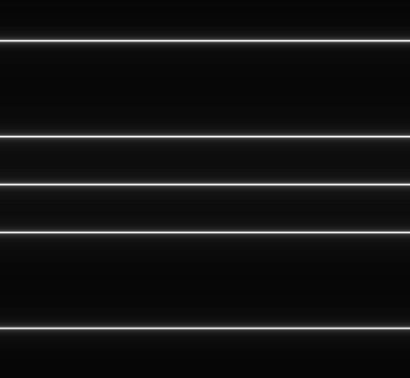
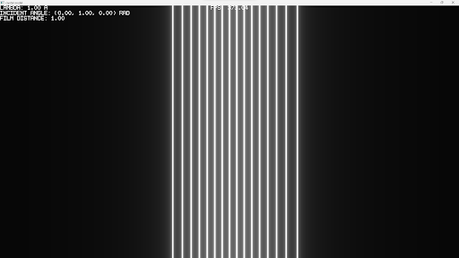

# crystallography-model (draft)

A 3d simulator of crystallography interference and diffraction images by using the Laue's equation. It's written in C and it uses the [`Vulkan API`](https://www.vulkan.org), [`shengine`](https://mrsinho.github.io/shengine-docs) and [`shvulkan`](https://github.com/mrsinho/shvulkan).


[](https://github.com/mrsinho/crystallography-model)

[TOC]

## To do:

* Generate real 3d cones with shaders (need to rewrite shaders)
* Add projections of the cones on the film
    * currently the film is only a canvas of angles
    * missing orientation and position of the lattice and of the film
* smd loader for 1d/2d/3d lattice properties and film properties
* 3d view
* abstract 3d library from the application
* shci tests

## Blender draft
    


## Overview

This template has been used on many libraries (see [`shengine`](https://mrsinho.github.io/shengine-docs), [`shgui`](https://mrsinho.github.io/shgui-docs))


## (Skip) CMakeLists.txt generation

```shell
cd externals/shengine
python export-application.py name=crystal-model path=../../crystal-model
```

## Build

Building the program is fairly simple:

```shell
cd    crystal-model
mkdir build
cd    build
cmake ../ -DCRYSTAL_MODEL_BINARY_TYPE=EXECUTABLE -DSH_ENGINE_ROOT_DIR="absolute/path/to/shengine/submodule"
```

## Current renders



A,alphai=(0, 90)degrees.png)

## Contributions and support

Should you encounter any issues with the tools or wish to introduce new features, I welcome your contributions to the repository. You can contribute by either opening an issue or submitting a pull request.


[](https://www.buymeacoffee.com/mrsinho)

