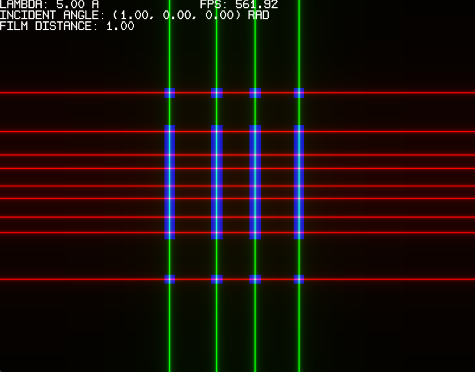

# crystallography-model (pre-release)

A 3d simulator of crystallography interference and diffraction images by using the Laue's equation. It's written in C and it uses the [`Vulkan API`](https://www.vulkan.org), [`shengine`](https://mrsinho.github.io/shengine-docs) and [`shvulkan`](https://github.com/mrsinho/shvulkan).


[](https://github.com/mrsinho/crystallography-model)

[TOC]

## Overview

This template has been used on many libraries (see [`shengine`](https://mrsinho.github.io/shengine-docs), [`shgui`](https://mrsinho.github.io/shgui-docs))


## (Skip) CMakeLists.txt generation

```shell
cd externals/shengine
python export-application.py name=crystal-model path=../../crystal-model
```

If you exectued the command above by mistake just type ¯git stash` on the terminal.

## Generate project files and build

Building the program is fairly simple:

```shell
mkdir model/build
mkdir model/build/windows
cd    model/build/windows
cmake ../../ -DCRYSTAL_MODEL_BINARY_TYPE=EXECUTABLE -DSH_ENGINE_ROOT_DIR="repo/absolute/path/externals/shengine"
cmake --build .
```

```shell
mkdir model/build
mkdir model/build/linux
cd    model/build/linux
cmake ../../ -DCRYSTAL_MODEL_BINARY_TYPE=EXECUTABLE -DSH_ENGINE_ROOT_DIR="repo/absolute/path/externals/shengine"
cmake --build .
```

## Run crystal model executable

```shell
./bin/windows/crystal-model
```

## Usage of configuraction files

At `crystal-model/smd/saved.smd` you can edit the main parameters used in crystallography, suchh as the incident ray wavelength and orientation in space, the lattice unit structure and the photosensitive matrix or film distance from the crystal.

```shell
FLOAT32    ^^ 1    !! lambda_ag       --> 5 ***
FLOAT32    ^^ 4    !! incident_ray    --> 1, 0, 0 ***

UINT32     ^^ 1    !! atom_count         --> 4 ***
FLOAT32    ^^ 16   !! atoms_positions_ag --> 0 0 0 1 0 10 0 1 0 10 0 1 10 0 0 1 ***

FLOAT32    ^^ 1    !! film_distance_cm --> 1 ***
```

To load the written or saved data from `crystal-model/smd/saved.smd` press `LEFT_CTRL` + `L`. To recovery the default information press `LEFT_CTRL` + `R`. To export the current information data to `crystal-model/smd/saved.smd`, press `LEFT_CTRL` + `E`.


## Commands

|Parameter        |Increase keys    |Decrease keys    |
|-----------------|-----------------|-----------------|
| `lambda_ag`     |       _W_       |       _Q_       |
| `incident_ray`  |     _S F H_     |     _A D G_     |
| `film_distance` |       _X_       |       _Z_       |



## To do:

* Generate real 3d cones with shaders (need to rewrite shaders)
* Add projections of the cones on the film
    * currently the film is only a canvas of angles
    * missing orientation and position of the lattice and of the film
* 3d view
* abstract 3d library from the application
* shci tests
* From a source image find the lattice
* Compute interference coordinates and angles before fragment shader. Then check pixel coordinates with a tolerance threshold.
* From soure image to 3d model
* Make separate views of lattice and of interference rendering


## Contributions and support

Should you encounter any issues with the tools or wish to introduce new features, I welcome your contributions to the repository. You can contribute by either opening an issue or submitting a pull request.

[](https://www.buymeacoffee.com/mrsinho)

